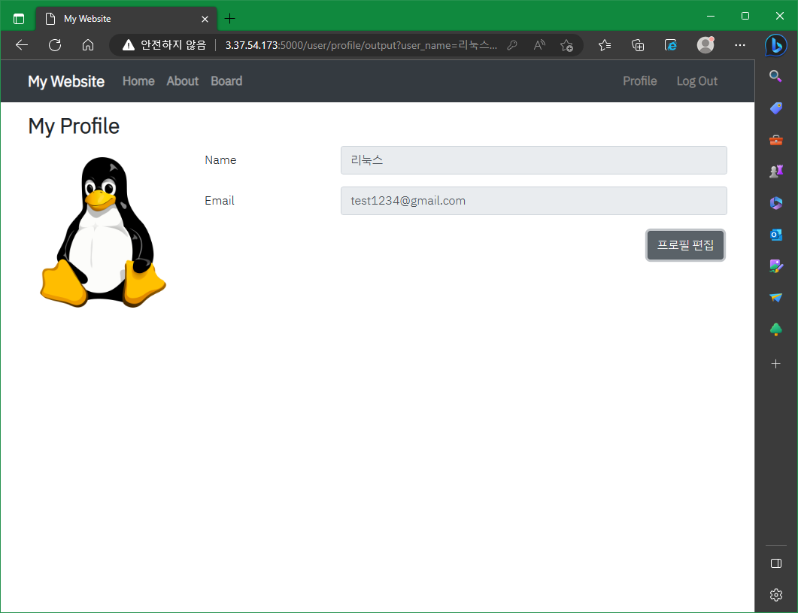

# 개발판 프로젝트

>**목적** : 배포된 프로젝트를 통하여, 배운 내용을 바로 적용시켜 고도화해보거나, 추가적인 공부를 위한 용도

- [MongoDB Board](https://github.com/SoN-B/Node.JS-Board) 개인 스터디 내용을 활용하여, MySQL 시스템으로 전환하였고, 현재는 팀 프로젝트로까지 발전했습니다.
- Passport 로그인 방식 -> JWT 로그인 방식으로 전환
- Bootstrap 4.6.2을 활용한 페이지 구성 & 프론트와 백엔드의 통신과정 이해

## 📚 Contents

- [Features](#-Features)
- [API Reference](#-API-Reference)
- [Database ERD](#-Database-ERD)
- [Execution Screens](#-Execution-Screens)
- [Module](#-Dependency-Module)

## ⚙ Features

    1. JWT를 활용한 로그인, 회원가입
    2. Access 토큰 이외 Refresh 토큰을 추가하여 보안 강화
    3. 로컬 스토리지를 활용한 토큰 저장 & 로그아웃
    4. MD5 해시 함수를 활용하여 사용자 비밀번호 단방향 암호화
    5. 기본적인 게시판 CRUD
    6. 페이징 기능 & 해당 페이지에 보여줄 게시글 수 지정 가능
    7. (제목, 내용), (제목), (내용), (작성자)의 종류로 게시글 검색 가능
    8. 해당 게시글 조회 시, 조회 수 증가 & 추천 기능
    9. 해당 게시글과 현재 로그인된 사용자를 비교하여 특정 권한 지정
    10. 주소 상의 쿼리 스트링을 활용하여, 이전 페이지 기억
    11. 유저 프로필 변경 기능
    12. CodeDeploy, CodePipeLine을 통한 CI/CD 구현

## 📝 API Reference

>**HOME**

**GET** / - 홈 화면 렌더링

**GET** /about - 홈페이지에 대한 설명 페이지 렌더링

<br>

>**USER**

<details>

<summary><b>POST</b> /user/login - 로그인 post 요청</summary>

* [프론트](./FrontEnd/public/js/user/login.js)

  * 이메일 & 비밀번호 유효성 검사 & 전달

  * 정상 응답받을 시, 로컬 스토리지에 해당 Access & Refresh 토큰 저장하고 홈 화면으로 이동

* [백엔드](./BackEnd/src/controllers/user.js)

  * 요청받은 이메일로 유저를 검색하고, 비밀번호 복호화 후 동일하면 Access & Refresh 토큰 리턴

</details>

<details>

<summary><b>POST</b> /user/register - 회원가입 post 요청</summary>

* [프론트](./FrontEnd/public/js/user/register.js)

  * 유저명 & 이메일 & 비밀번호 유효성 검사

  * 유저명 & 이메일 & 비밀번호 전달

  * 응답받은 코드가 200일시, 로그인 화면 이동

  * 응답받은 코드가 200이 아닐 시, 에러 메시지 화면 출력

* [백엔드](./BackEnd/src/controllers/user.js)

  * 요청받은 유저명 & 이메일 & 비밀번호 유효성 검사

  * 유저명 & 이메일 중복체크

  * 이상 없을 시, 비밀번호 암호화 후 성공 코드 200 반환

</details>

<details>

<summary><b>GET</b> /user/profile - 프로필 열람 시, 유저 토큰 검사 요청</summary>

* [프론트](./FrontEnd/public/js/index.js)

  * 화면상 프로필 클릭 시, 로컬스토리지안의 Access 토큰 전달

  * 응답받은 코드가 200일시, 유저정보를 파라미터로 파싱 하여, 해당 주소로 이동

  * 응답받은 코드가 419일시, Refresh 토큰으로 Access 토큰 재발급 요청. 그 후, 재발급 받은 Access 토큰 저장

  * 응답받은 코드가 이외의 것일 시, 재로그인을 위한 로그인 페이지로 이동

* [백엔드](./BackEnd/src/controllers/user.js)

  * 받은 토큰 검사 후, 해당 토큰에 대한 유저정보 전달

</details>

<details>

<summary><b>PATCH</b> /user/profile - 프로필 편집</summary>

* [프론트](./FrontEnd/public/js/user/profile.js)

  * 유저명 & 이메일 유효성 검사

  * 유저명 & 이메일 & 프로필 사진 전달

  * 응답받은 코드가 200일시, 유저에 대한 정보를 화면에 출력

  * 응답받은 코드가 400일시, 에러 메시지 화면 출력하고 프로필 페이지 새로고침

* [백엔드](./BackEnd/src/controllers/user.js)

  * 이미지 파일이 10MB 이상일 시, 에러 메시지 반환.

  * 이미지 파일이 아닌 경우, 에러 메시지 반환.

  * 아무것도 변경하지 않았을 시, "Profile no change" 반환.

  * 유저명 & 이메일 중복체크

  * 그 이외의 경우, 유저정보 업데이트 후, 성공 코드 200 반환

</details>

**GET** /user/token/refresh - refresh 토큰 받아서, access token 재발급

**GET** /user/login - 로그인 페이지 렌더링

**GET** /user/register - 회원가입 페이지 렌더링

**GET** /user/profile/output - 프로필 페이지 렌더링

<br>

>**BOARD**

<details>

<summary><b>GET</b> /board - 조건에 따른 글 데이터 전달</summary>

* [프론트](./FrontEnd/views/post/index.ejs)

  * 위 메뉴 'Board'를 클릭 시, /board API 호출

  * 글 ID, 제목, 조회 수, 작성자, 작성 시간 등을 표시할 수 있다.

  * 글의 (제목, 글),(제목),(글),(작성자)로 게시글을 검색할 수 있다.

  * 페이지가 존재하고, 페이지당 표시될 게시글의 수를 정할 수 있다.

  * New 버튼 클릭 시, 브라우저 내 로컬 스토리지에서 토큰 검사 (토큰이 없을 시, 로그인 화면으로 이동)

* [백엔드](./BackEnd/src/controllers/board.js)

  * 프론트로부터 page, limit, Search 종류 등을 전달받아, 해당 조건에 맞는 게시글로 응답

  * page 값이 1000 이상일 시, 에러 메시지 반환

  * page 값이 1000미만이고, 최대 페이지를 넘는 경우, 최대 페이지로 반환

  * limit 값이 5, 10, 20 이외의 값일 시, 에러 메시지 반환

</details>

<details>

<summary><b>POST</b> /board - 글 생성</summary>

* [프론트](./FrontEnd/public/js/post/create.js)

  * 제목 & 글 유효성 검사

  * 작성하고자 하는 제목과, 글을 입력 후 Access 토큰과 함께, 해당 데이터 전달

  * 글 전달 후, 419코드를 응답받게 되면, Refresh 토큰으로 Access 재발급 요청

  * 그 이외의 코드는 로그인 화면 이동

* [백엔드](./BackEnd/src/controllers/board.js)

  * 프론트쪽에서부터 전달받은 토큰 검사 후, 해당 데이터로 글 생성

</details>

<details>

<summary><b>GET</b> /board/:id - id 번호의 글 페이지 렌더링</summary>

* [프론트](./FrontEnd/views/post/index.ejs)

  * /board 페이지에서 해당 글을 클릭 시, 현재 페이지 & 검색어 등을 기억하며, /board/:id API 호출

  * 그 후, 페이지에서 항상 작성된 글과 현재 로그인한 사용자와 매칭하여 작성자가 맞는다면, [Back] 버튼 이 외 [Edit], [Delete] 버튼 노출

  * [Back] & [Edit] -> 현재 페이지 & 검색어 등을 기억, [Delete] 버튼 작동 시, 1페이지로 이동

* [백엔드](./BackEnd/src/controllers/board.js)

  * 호출 요청을 받고, 파라미터의 id를 파싱 하여 해당 id의 게시글 데이터로 응답과 함께, [작성된 페이지](./FrontEnd/views/post/read.ejs) 렌더링

  * API 요청당 조회 수 +1

</details>

**DELETE** /board/:id - id 번호의 글 삭제

<details>

<summary><b>PATCH</b> /board/:id/edit - id 번호의 글 edit 후 post</summary>

* [프론트](./FrontEnd/public/js/post/update.js)

  * 수정하고자 하는 해당 글의 제목 & 글 유효성 검사

  * Access 토큰과 함께 수정 API 호출

* [백엔드](./BackEnd/src/controllers/board.js)

  * 프론트로부터 전달받은 데이터로 해당 게시글 내용 변경

</details>

<details>

<summary><b>POST</b> /board/:id/recommand - id 번호의 글 추천</summary>

* [프론트](./FrontEnd/public/js/post/read.js)

  * 토큰이 없을 시, 로그인 화면으로 이동

  * 추천 버튼 클릭 시, 해당 글의 id & JWT 토큰과 함께 추천 API 호출

  * 추천 API 호출 후, 419코드를 응답받게 되면, Refresh 토큰으로 Access 재발급 요청

  * 유저가 이미 추천한 글일 시, 추천 취소됨 표시

  * 유저가 추천하지 않은 글일 시, 추천됨 표시

* [백엔드](./BackEnd/src/controllers/board.js)

  * user_post테이블로부터, 해당 유저가 해당 글을 추천한 적이 있는지 확인

  * 추천한 적이 없다면, 추천 데이터 생성 후, 해당 글의 추천 수 +1

  * 추천한 적이 있다면, 추천 데이터 삭제 후, 해당 글의 추천 수 -1

</details>

<details>

<summary><b>GET</b> /board/:id/auth - 해당 글 작성자와 로그인 중인 사용자 일치 확인(인증)</summary>

  * 프론트로부터 토큰을 전달받고, 토큰 검사 후, 주소상 게시글의 id가 토큰에 존재하는 사용자가 작성한 글이 맞는지 확인

  * 그 후, 해당 글 페이지의 [back] or [back, edit, delete] button 출력여부 결정

</details>

**GET** /board/post/new - 글 생성 페이지 렌더링

**GET** /board/:id/edit - id 번호의 글 데이터와 함께, edit 페이지 렌더링

## ⛓ Database ERD


## 💻 Execution Screens

>**Main**

|  |  |  |  |
| :-----------------------------------------------------------------------------------------------------------------: | :-----------------------------------------------------------------------------------------------------------------: | :-----------------------------------------------------------------------------------------------------------------: | :-----------------------------------------------------------------------------------------------------------------: |
|                                                      홈 화면                                                      |                                                       로그인                                                        |                                                      회원가입                                                       |                                                     프로필                                                      |

<br>

>**Board**

|  |  |  |  |
| :-----------------------------------------------------------------------------------------------------------------: | :-----------------------------------------------------------------------------------------------------------------: | :-----------------------------------------------------------------------------------------------------------------: | :-----------------------------------------------------------------------------------------------------------------: |
|                                                      게시판 메인                                                      |                                                       게시글 제한                                                        |                                                      글 & 제목 검색                                                       |                                                     유저 검색                                                      |

<br>

>**Board Content**

|  |  |  |  |
| :-----------------------------------------------------------------------------------------------------------------: | :-----------------------------------------------------------------------------------------------------------------: | :-----------------------------------------------------------------------------------------------------------------: | :-----------------------------------------------------------------------------------------------------------------: |
|                                                      게시글 생성                                                      |                                                       게시글 읽기                                                        |                                                      게시글 수정                                                       |                                                     게시글 삭제                                                      |

## 🛠 Dependency Module

```
  "dependencies": {
    "@sentry/node": "^7.49.0",
    "aws-sdk": "^2.1338.0",
    "bcrypt": "^5.0.1",
    "body-parser": "^1.20.0",
    "config": "^3.3.7",
    "ejs": "^3.1.8",
    "express": "^4.18.1",
    "jsonwebtoken": "^8.5.1",
    "method-override": "^3.0.0",
    "morgan": "^1.10.0",
    "multer": "^1.4.5-lts.1",
    "multer-s3": "^2.10.0",
    "mysql2": "^2.3.3",
    "sequelize": "^6.21.3",
    "sequelize-cli": "^6.4.1",
    "winston": "^3.8.2",
    "winston-daily-rotate-file": "^4.7.1"
  },
  "devDependencies": {
    "eslint": "^8.36.0",
    "eslint-config-prettier": "^8.7.0",
    "eslint-plugin-prettier": "^4.2.1",
    "prettier": "^2.8.4",
    "standard-version": "^9.5.0"
  }
```
